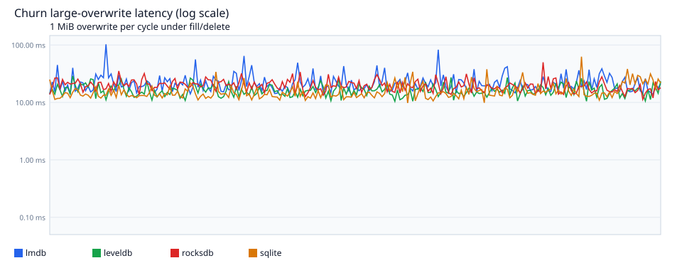
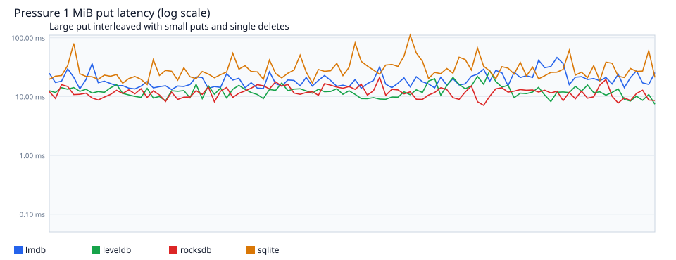
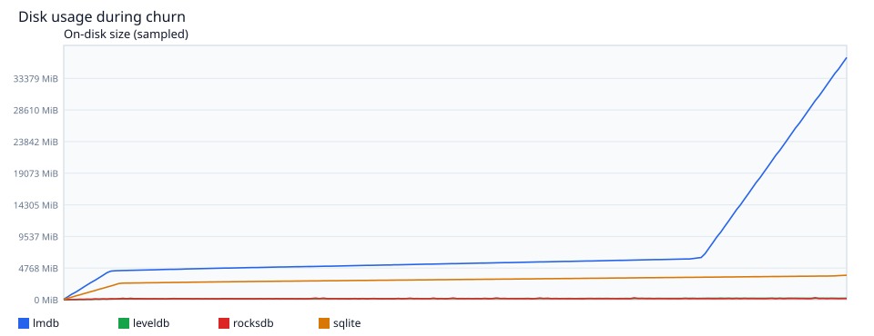

# Churn fragmentation benchmark — raport 2

Data: 2026-09-06T11:59:01.614Z

## Parametry

| parametr | wartość |
| --- | --- |
| `--size` | 400000 |
| stores | 24 |
| prefill / store | 16667 |
| prefill total | 400008 |
| cycles | 10000 |
| pinned cycles | 2500 |
| small payload | 1024–8192 B |
| large payload | 1048576 B (1 MiB) |
| small puts / store / cykl | 8 |
| single deletes / store / cykl | 4 |
| TTL prune / cykl | 64 |
| pressure iters | 100 |
| fill payload | 12316.4 MiB |

## Co testowane i po co

`bench/fragmentation` nie łapał wzrostu latency: jeden store, prune ciągłego prefiksu (jedna duża dziura), batchowany `rangeDelete` i zero małych zapisów między prune a large-put.

Ten suite celuje we wspólny freeDB / allocator przy wielu tabelach:

1. **Prefill** — 24 named store'y w jednym env, round-robin, monotoniczne id, 1–8 KiB.
2. **Churn** — K cykli: małe puty, **pojedyncze** `delete` (osobne transakcje), `rangeDelete` ze środka zakresu, TTL-prune najstarszych, mierzony overwrite 1 MiB pod stałym kluczem.
3. **Pressure** — 1 MiB put przeplatany małym churnem. Slope mówi, czy latency **rośnie**, nie tylko jaki jest max.
4. **Pinned reader** — długo żyjący read txn (LMDB; SQLite jeśli się uda przy EXCLUSIVE lock) — strony zwolnione po nim nie wracają do allocatora.

## Podsumowanie liczb

| backend | churn p50 | churn p99 | churn max | slope | pressure p50 | pressure p99 | pressure max | pslope | pinned max | disk |
| --- | --- | --- | --- | --- | --- | --- | --- | --- | --- | --- |
| lmdb | 19.23ms | 49.33ms | 146.06ms | 8.0e-5ms/i | 18.14ms | 41.44ms | 46.20ms | 0.066ms/i | 118.69ms | 36522.9MiB |
| leveldb | 15.65ms | 31.23ms | 80.52ms | -5.4e-5ms/i | 12.03ms | 22.01ms | 27.51ms | 2.5e-3ms/i | skip | 217.6MiB |
| rocksdb | 19.14ms | 33.74ms | 52.09ms | -4.4e-4ms/i | 11.85ms | 19.49ms | 21.24ms | -5.7e-3ms/i | skip | 169.8MiB |
| sqlite | 14.12ms | 40.31ms | 81.47ms | 5.9e-4ms/i | 26.23ms | 81.32ms | 110.66ms | 0.072ms/i | skip | 3689.9MiB |

## Latency overwrite vs cykl

Oś Y logarytmiczna. Szukamy **slope**, nie pojedynczego max.

## Pressure (duży put pod churnem)

## Disk w czasie

## Interpretacja per backend

**lmdb** — max overwrite 146.06 ms — poniżej progu „kilka minut”. Churn slope ≈ 0 — na tej skali nie widać narastania. Pinned reader max 118.69 ms — bez silnego dodatkowego kosztu na tej skali. LMDB: wspólny freeDB dla 24 DBI, first-fit na overflow (1 MiB = 256 stron).

**leveldb** — max overwrite 80.52 ms — poniżej progu „kilka minut”. Churn slope ≈ 0 — na tej skali nie widać narastania. Pinned reader pominięty: leveldb has no pinned-reader API. LSM: brak reuse stron — wzrost to compaction / write amplification.

**rocksdb** — max overwrite 52.09 ms — poniżej progu „kilka minut”. Churn slope ≈ 0 — na tej skali nie widać narastania. Pinned reader pominięty: rocksdb has no pinned-reader API. LSM: brak reuse stron — wzrost to compaction / write amplification.

**sqlite** — max overwrite 81.47 ms — poniżej progu „kilka minut”. Churn slope ≈ 0 — na tej skali nie widać narastania. Pinned reader pominięty: database is locked. SQLite: overflow to linked-list, nie wymaga ciągłego runu stron.

## Wnioski

- Najniższy max overwrite: **rocksdb** (52.09 ms).
- Najwyższy max overwrite: **lmdb** (146.06 ms).
- Żaden backend nie pokazał wyraźnego wzrostu latency vs liczba cykli (slope ≤ 0.05 ms/cykl).
- Żaden backend nie osiągnął kilkuminutowego put. Hipoteza minutowego LMDB wymaga większego K albo większego value (więcej ciągłych overflow pages).

## Artefakty

- `report-2.json` — pełny wynik runnera (`metrics` + osadzony CSV)
- `churn-timeseries-<backend>-2.csv` — time-series per backend
- `churn-chart-overwrite-2.svg`, `churn-chart-pressure-2.svg`, `churn-chart-disk-2.svg`
- ten plik: `churn-report-2.md`
