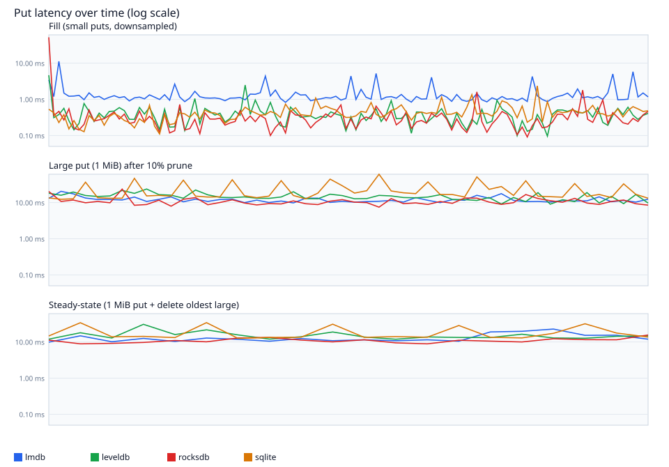
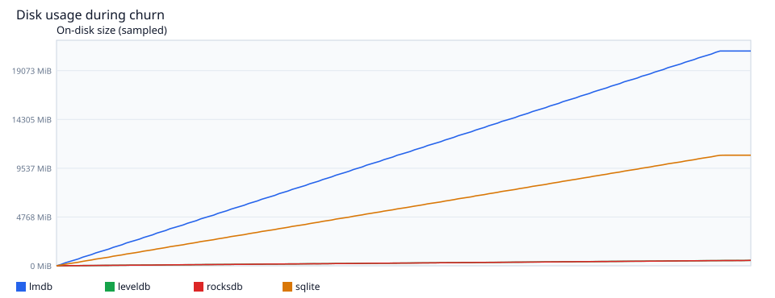

# Fragmentation benchmark — raport

Data: 2026-09-06T07:33:11.057Z

## Parametry

| parametr | wartość |
| --- | --- |
| `--size` | 500000 |
| fill N | 500000 |
| fill payload | 9.76 GiB |
| delete (najstarsze 10%) | 50000 |
| small payload | 1024–40960 B |
| large payload | 1048576 B (1 MiB) |
| large puts | 50 |
| steady iterations | 20 |

## Co testowane i po co

W bot-serverze LMDB potrafi zablokować put na **kilka minut**, gdy baza jest po churnie: dużo małych rekordów (komendy, eventy, presence), potem kasowanie najstarszych po czasie, a następnie zapis dużego obiektu (scan/snapshot-like payload). LMDB szuka wtedy wolnych overflow pages first-fit — przy dziurawej freeDB to skan, nie O(1).

Ten benchmark odtwarza ten cykl na jednym named store, bez aplikacji:

1. **Fill** — monotoniczne `padId(i)`, losowy rozmiar 1–40 KiB (ten sam ciąg u wszystkich backendów, seed stały).
2. **Prune** — `rangeDelete({ lt: padId(N*0.1) })`, najstarsze 10%, nie losowe kasowanie. To zostawia ciągłe dziury jak TTL komend.
3. **Large put** — 50 obiektów 1 MiB. Mierzymy p50/p99/**max** per put. Max to to, co user czuje jako „zamuliło”.
4. **Steady-state** — 20× (1 MiB put + delete najstarszego dużego). Pokazuje, czy latency **rośnie w czasie**, nie tylko po jednorazowym prune.

Skala `--size 10000` ≈ 200 MiB fill; `--size 500000` ≈ 10 GiB payload. `mapSize` / sqlite `mmap_size` idzie przez `--map-size` (skrypt `fragment:10g` ustawia 64 GiB).

## Podsumowanie liczb

| backend | fill ops/s | delete | large p50 | large p99 | large max | steady p50 | steady p99 | steady max | disk |
| --- | --- | --- | --- | --- | --- | --- | --- | --- | --- |
| lmdb | 690 | 2.82s | 11.52ms | 20.50ms | 20.50ms | 11.85ms | 22.76ms | 22.76ms | 20993.5MiB |
| leveldb | 2442 | 7.14s | 14.23ms | 23.72ms | 23.72ms | 13.82ms | 30.78ms | 30.78ms | 516.0MiB |
| rocksdb | 2947 | 5.24s | 10.05ms | 23.60ms | 23.60ms | 11.01ms | 15.61ms | 15.61ms | 533.6MiB |
| sqlite | 1475 | 8.36s | 15.83ms | 60.74ms | 60.74ms | 13.89ms | 34.19ms | 34.19ms | 10805.7MiB |

## Latency w czasie

Oś Y logarytmiczna — p50 bywa w milisekundach, max w sekundach/minutach. Fill jest downsamplowany, large-put i steady są pełne.

## Disk w czasie

Czy plik bazy wraca po prune, czy tylko rośnie. Sample w fill co 1000 ops, large-put co 5, steady co 2.

## Interpretacja per backend

**lmdb** — max large-put 20.50 ms — poniżej progu „kilka minut”; put nie blokuje procesu na długo. Steady-state nie pogarsza się istotnie względem pierwszej serii large-put — allocator/compaction trzyma się w ryzach na tej skali. LMDB szuka wolnych overflow pages first-fit po freeDB. Ciągłe dziury po prune najstarszych + 1 MiB value to dokładnie ten przypadek.

**leveldb** — max large-put 23.72 ms — poniżej progu „kilka minut”; put nie blokuje procesu na długo. LSM (memtable → SST). „Fragmentacja” objawia się compaction stall / write amplification, nie wyszukiwaniem wolnego extentu.

**rocksdb** — max large-put 23.60 ms — poniżej progu „kilka minut”; put nie blokuje procesu na długo. Steady-state nie pogarsza się istotnie względem pierwszej serii large-put — allocator/compaction trzyma się w ryzach na tej skali. LSM (memtable → SST). „Fragmentacja” objawia się compaction stall / write amplification, nie wyszukiwaniem wolnego extentu.

**sqlite** — max large-put 60.74 ms — poniżej progu „kilka minut”; put nie blokuje procesu na długo. Steady-state nie pogarsza się istotnie względem pierwszej serii large-put — allocator/compaction trzyma się w ryzach na tej skali. SQLite WITHOUT ROWID + WAL + freelist. Duży value idzie do overflow pages; reuse po DELETE powinien być tańszy niż skan LMDB.

## Wnioski

- Najniższy max large-put: **lmdb** (20.50 ms).
- Najwyższy max large-put: **sqlite** (60.74 ms).
- Żaden backend nie osiągnął kilkuminutowego put na tej skali (9.76 GiB payload, 1 MiB value, jednorazowy prune 10% najstarszych na jednym store). To nie odtwarza jeszcze patologii bot-server (wiele tabel, wielokrotny churn, dziury różnych rozmiarów).
- Na tej skali steady-state nie pokazał silnego narastania latency u żadnego z przebiegów pass.

## Artefakty

- `report.json` — pełny wynik runnera (`metrics` + osadzony CSV)
- `fragmentation-timeseries-<backend>.csv` — time-series per backend
- `fragmentation-chart-latency.svg`, `fragmentation-chart-disk.svg`
- ten plik: `fragmentation-report.md`
